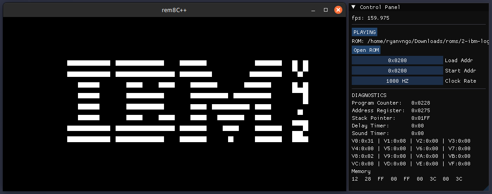

# rem8C++ - CHIP-8 Emulator

An enhanced C++ version of [rem8C](https://github.com/RyanVNgo/rem8C).

## Project Dependencies
> [!IMPORTANT]
> This project requires `vcpkg` for package installation and `cmake` for building.


## Downloading and Building
### Download the project
```sh
git clone https://github.com/RyanVNgo/rem8Cpp.git
cd rem8Cpp
```

### Set up `CMakeUserPresets.json`
In the project home directory, create a file called `CMakeUserPresets.json` and copy the following into the file.

```sh
{
  "version": 2,
  "configurePresets": [
    {
      "name": "default",
      "inherits": "vcpkg",
      "environment": {
        "VCPKG_ROOT": "{PATH_TO_VCPKG_DIRECTORY}"
      }
    }
  ]
}
```

Replace `{PATH_TO_VCPKG_DIRECTORY}` with the path to your downloaded and setup vcpkg directory — for example `/home/user/tools/vcpkg/`.

### Downlaod packages and build project
```sh
cmake --preset=default
cmake --build build
```

## Usage
After building the project, you can start using the emulator by running the `rem8C++` executable in the `build/` directory.



### Loading a ROM
To load a ROM:
- click on the **Open ROM** button in the control panel to open the file explorer
- navigate to your ROM and click on it in the explorer, the file path should appear in the top bar
- click on the **Open** button to load it into the emulator
- run the ROM by clicking on the **PAUSED/PLAYING** button in the control panel (it should appear as **PAUSED** at this point).

If desired, you can change the load address and start address when loading a ROM *(because of some current implementation quirks,
it is recommended to leave these at their default values)*.

You can also change the clock rate of the emulator between 0hz - 20000hz with the **Clock Rate** drag slider.


### Diagnostics in the Control Panel
- `fps`: frames per second*
- `Program Counter`: Current location of the program counter
- `Address Register`: Current value stored in the addres register (I Register)
- `Stack Pointer`: Current location of the stack pointer
- `Delay Timer`: Current value of the delay timer
- `Sound Timer`: Current value of the sound timer*
- `V0 - VF`: The values stored in each of the 16 data registers
- `Memory`: Displays the 8 bytes of data at and following the current instruction (PC to PC + 8)

<sub>
 * - There is no sound
</sub>
